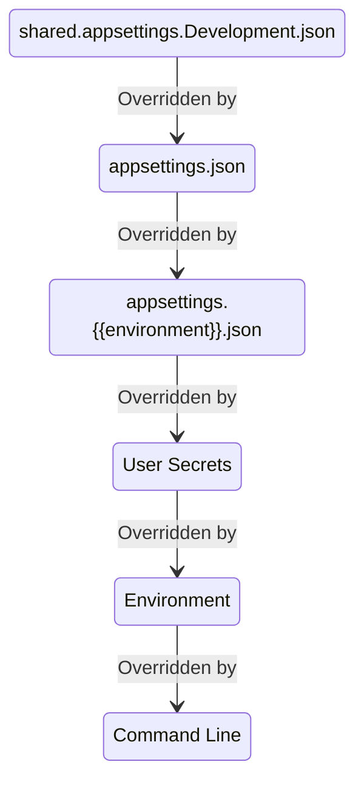
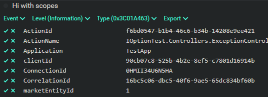
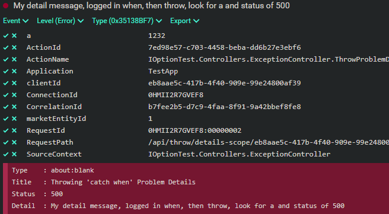

# IConfiguration & IOptions & ILogger Test <!-- omit in toc -->

- [IConfiguration](#iconfiguration)
  - [ASP.NET's Default IConfiguration](#aspnets-default-iconfiguration)
  - [Syntax for Values](#syntax-for-values)
  - [JSON Files](#json-files)
  - [Environment Variables](#environment-variables)
  - [Command Line](#command-line)
- [Options Pattern](#options-pattern)
  - [Options Validation Using Attributes](#options-validation-using-attributes)
- [ILogger](#ilogger)
  - [Scoped Logging](#scoped-logging)
  - [Scoped Logging And Exceptions](#scoped-logging-and-exceptions)
  - [Using LoggerMessage for High-Performance Logging](#using-loggermessage-for-high-performance-logging)
- [Test App's Endpoints](#test-apps-endpoints)
- [Running Seq Locally To View Semantic Logs](#running-seq-locally-to-view-semantic-logs)
- [Exercising the Endpoints From PowerShell](#exercising-the-endpoints-from-powershell)
- [Console Apps](#console-apps)
- [Generating Code From the OAS file](#generating-code-from-the-oas-file)
- [Returning ProblemDetails from a Controller](#returning-problemdetails-from-a-controller)
  - [.NET 7's ProblemDetailsService](#net-7s-problemdetailsservice)
  - [.NET 6 Method](#net-6-method)
  - [Using Hellang's Middleware (ExceptionHandlerEnum.UseHellang)](#using-hellangs-middleware-exceptionhandlerenumusehellang)
  - [Error Pages (ExceptionHandlerEnum.UsePages)](#error-pages-exceptionhandlerenumusepages)
  - [Function to Handle Error (ExceptionHandlerEnum.UseExceptionHandler)](#function-to-handle-error-exceptionhandlerenumuseexceptionhandler)
  - [Custom Middleware (ExceptionHandlerEnum.UseMyMiddleWare)](#custom-middleware-exceptionhandlerenumusemymiddleware)
- [Codespace-Enabled Repo](#codespace-enabled-repo)
  - [Links](#links)

This repo has tests for `IOptions`, `IConfiguration`, and `ILogger`. This sample ASP.NET app demonstrates the topics briefly described below.

## [IConfiguration](https://docs.microsoft.com/en-us/dotnet/api/microsoft.extensions.configuration.iconfiguration)

This can be injected into any class and used to get loose values from configuration providers, or a section of values into an object.

### ASP.NET's Default IConfiguration

This is built when the ASP.NET app is built. The default [configuration in ASP.NET Core](https://docs.microsoft.com/en-us/aspnet/core/fundamentals/configuration/?view=aspnetcore-6.0#default-application-configuration-sources) has these providers in priority order:

1. CommandLine
1. Environment variables w/o ASPNETCORE_ or DOTNET_ prefix. Hierarchical values use __ separator everywhere (colon in JSON)
1. User secrets (dev only)
1. appsettings.{environment}.json where environment is ASPNETCORE_ENVIRONMENT value
1. appsettings.json
1. shared.appsettings.Development.json (custom one added)

This diagram shows what is read with each subsequent level adding or replacing values.



### Syntax for Values

For nested items, colons are used to separate the levels, except in environment variables, where double underscores are used.

### [JSON Files](https://docs.microsoft.com/en-us/aspnet/core/fundamentals/configuration#file-configuration-provider)

These are pretty straightforward. For complex objects, you may combine the levels with a colon, or split them. The following are equivalent:

```json
{
    "Snapshot:FromEnvironment":"test"
}
```

```json
{
    "Snapshot":
    {
        "FromEnvironment":"test"
    }
}
```

### [Environment Variables](https://docs.microsoft.com/en-us/aspnet/core/fundamentals/configuration#evcp)

Windows will tolerate colon separators, but it is best to always use double underscores, especially if you will be deploying to Linux, Mac, or Linux containers.

```powershell
$env:OneTime__FromEnvironment = "EnvironmentSettings5"
```

### [Command Line](https://docs.microsoft.com/en-us/aspnet/core/fundamentals/configuration#command-line)

The syntax is not intuitive. You use `MyKey` to indicate how the key values are used, then follow that by the values. The following are all equivalent:

```powershell
dotnet run MyKey="Using =" Snapshot:FromEnvironment=test
dotnet run /MyKey="Using /" /Snapshot:FromEnvironment=test
dotnet run --MyKey="Using --" --Snapshot:FromEnvironment=test
```

## [Options Pattern](https://docs.microsoft.com/en-us/aspnet/core/fundamentals/configuration/options)

The Option pattern uses IConfiguration but binds a POCO to a configuration section. The POCO is a wrapper with an IOption* interface, which can be injected into any class. There are three flavors:

- [IOptions&lt;TOptions&gt;](https://docs.microsoft.com/en-us/dotnet/api/microsoft.extensions.options.ioptions-1) are read once, the first time accessed.
- [IOptionsMonitor&lt;TOptions&gt;](https://docs.microsoft.com/en-us/dotnet/api/microsoft.extensions.options.ioptionsmonitor-1) are read each time and are a singleton.
- [IOptionsSnapshot&lt;TOptions&gt;](https://docs.microsoft.com/en-us/dotnet/api/microsoft.extensions.options.ioptionssnapshot-1) are read each time and are a scopes so can be injected anywhere.

### Options Validation Using Attributes

Using `ValidateDataAnnotations` when registering options in `program.cs` will validate values of configuration when it is accessed the first time and throw an exception. This may occur long after app startup if the option isn't used earlier. `ValidateOnStart` can do validation when the app starts so you find out very early if your config is bad. `program.cs` in this sample does both.

## ILogger

ASP.NET has [ILogger](https://docs.microsoft.com/en-us/dotnet/api/microsoft.extensions.logging.ilogger) configured out of the box. This app adds a line of code to add [Serilog](https://serilog.net/) support that adds a wide range of options, formatters, and sinks.

All the configuration is done via the `IConfiguation` so you can have local development setup logging in `appsettings.Development.json` to override the default logging setup in `appsettings.json`.

In this program, dev logging is to the console, in human-readable format, whereas `appsettings.json` is set for using ElasticSearch logging. Log levels are read periodically so you can change them without restarting the app.

There are many sinks available, even one for Sentry (commented out in this sample) so you can configure all Error-level messages to automatically be sent there.

### Scoped Logging

Often when logging, you want all logged messages to have a `CorrelationId` or some other piece of data for the life of the request. I've done this before with a bunch of `ILogger` extension methods that took an additional parameter. A better way is to use `ILogger.BeginScope`. This method takes a dictionary and adds all the values to each log message. If you are using Serilog and semantic logging such as for ElasticSearch or Seq, all the values appear in the log for filtering and searching.

There are various ways to create scopes, such as the following:

- Call `BeginScope` at any time to manually create a scope.
- Create a scope from data from headers by using middleware to create a scope for the request. Since `BeginScope` returns an `IDisposable`, you have to dispose of it properly. The [CorrelationMiddleware.cs](src/Logging/CorrelationMiddleware.cs) sample code shows doing this.
- Create a scope from values passed in on the path using middleware, but the parsing of the url may be complex. A better way to get those values is to use an `IActionFilter` to get the already parsed values and create a scope. The [LoggingContextFilter.cs](src/LoggingContextFilter.cs) sample shows doing this.

Here's a log using that method that has the `clientId` and `marketEntityId` from the path (filter adds those), and the `CorrelationId` from the headers (middleware added it).



### Scoped Logging And Exceptions

There is a catch to using scopes when an exception is thrown. In the catch processing and thereafter, all your scopes are disposed, so the extra details are lost. There are a couple of ways to handle this. One is to use `catch () when` and call a function to log in the function called in `when` since the scopes are still alive then. The [LoggerExtensions](src/Logging/LoggerExtensions.cs) has methods that various flavors of that technique.

This is the pattern. `LogCaughtException` logs the exception with the `logger` and the scopes will be logged.

```csharp
try {
    return await func();
} catch (Exception ex) when (LogCaughtException(logger, ex)) {
    // never get here since LogCaughtException returns false
}
// or here
```

Here's a log using that method that has the `clientId` and `marketEntityId` from the path (filter adds those), and the `CorrelationId` from the headers (middleware added it).



Another way is to not log when you catch but use an `IActionFilter` to log. [ProblemDetailsExceptionFilter](src/ProblemDetailsExceptionFilter.cs) does this. `Program.cs` has a switch to turn it on, but since some exceptions are logged and then thrown, this will cause some duplicate logs -- in this sample. It does have the advantage that any thrown exception gets the scopes, as opposed to ones you may wrap with a logger extension method.

### Using LoggerMessage for High-Performance Logging

[LoggerMessage.Define()](https://docs.microsoft.com/en-us/dotnet/api/microsoft.extensions.logging.loggermessage.define), has been around for a while and makes logging messages more efficient. With .NET 6, there is a new [LoggerMessageAttribute](https://docs.microsoft.com/en-us/dotnet/api/microsoft.extensions.logging.loggermessageattribute) you can apply to a method in your class to make that even easier.

In the [links](#links) are some articles on this, but in the sample code there is a [LoggerController.LogMessageCount](src/Controllers/LoggerController.cs) method that calls the usual `_logger.Log` then this equivalent method

```csharp
[LoggerMessage(0, LogLevel.Information, "This is to say: {Message}")]
partial void LogMessage(string message);
```

The endpoint logs to the NullLogger as many times as you pass in. For 1 million logs you can see a significant performance improvement. Granted, the amount of time a method spends in logging is probably a small percentage, but this simple method does help. In addition, you get compile-time validation of the format string, and the generated code checks to see if the log level is enabled or not, which can save even more time.

```text
> .\l.ps1 1000000

loggerCallMs loggerMessageMs
------------ ---------------
         138               7
```

When actually logging (not using the NullLogger) the time is less dramatic but consistently faster.

```text
> .\l.ps1 250

loggerCallMs loggerMessageMs
------------ ---------------
         437             351
```

## Test App's Endpoints

| Name                                            | Description                                                 |
| ----------------------------------------------- | ----------------------------------------------------------- |
| /api/config                                     | Get Configuration from loose values                         |
| /api/config/section                             | Get Configuration from one section                          |
| /api/logger                                     | Log a message in 3 = INFO, 4 = WARN, 5 = ERROR, 6 = FATAL   |
| /api/logger/{logCount}?useNullLogger=true/false | Log to test LoggerMessage performance                       |
| /api/options                                    | Get configuration via IOptions (no refresh)                 |
| /api/options/monitored                          | Get configuration via IOptionsMonitor                       |
| /api/options/snapshot                           | Get configuration via IOptionsSnapshot                      |
| /api/options/throw                              | Sample to throw an error to demonstration logging scope     |
| /api/throw/details                              | Throw `ProblemDetailsException`                             |
| /api/throw/details-log                          | Log and throw `ProblemDetailsException`                     |
| /api/throw/details-scope                        | Throw `ProblemDetailsException` using `catch` `when` to log |
| /api/throw/not-implemented                      | Throw `NotImplementedException`                             |

## Running Seq Locally To View Semantic Logs

This repo logs to [Seq](https://datalust.co/seq) by default. Seq is a logging aggregator that you can run locally to see friendly versions of semantic logs.

```powershell
docker run -d --restart unless-stopped --name seq -e ACCEPT_EULA=Y -p 5341:80 datalust/seq:latest
```

Then hit http://localhost:5341/#/events to see the logs.

## Exercising the Endpoints From PowerShell

There are some helper scripts in the root

- ./c.ps1 # IConfiguration config
- ./o.ps1 # IOptions
- ./a.ps1 # all config
- ./l.ps1 # logging
- ./t.ps1 # throwing exceptions

## Console Apps

All of this can also be used in Console apps, but requires a bit more code since ASP.NET does so much for you. See other samples for its use.

## Generating Code From the OAS file

I used an [OAS file](oas/openapi.yaml) to generate code. This [repo](https://github.com/Seekatar/swagger-codegen) is the one I created and use to generate code from the OAS file.

```powershell
../swagger-codegen/Invoke-SwaggerGen.ps1 -OASFile ./oas/openapi.yaml -Namespace IOptionTest -OutputFolder /mnt/c/temp/options -RenameController
```

## Returning ProblemDetails from a Controller

### .NET 7's ProblemDetailsService

.NET 7 has a [ProblemDetailsService](https://learn.microsoft.com/en-us/dotnet/api/microsoft.aspnetcore.http.iproblemdetailsservice) as described in this [MS blog post](https://devblogs.microsoft.com/dotnet/asp-net-core-updates-in-dotnet-7-preview-7/#new-problem-details-service). In addition, [this blog](https://www.strathweb.com/2022/08/problem-details-responses-everywhere-with-asp-net-core-and-net-7/) also has a good overview. I added `DotNet7` enum value to be able to turn it on in `program.cs`

Simply turning it on is great if your in developer mode and add `UseDeveloperExceptionPage()`, but turning that off for a release build sends JSON that just looks like this regardless of the exception you throw.

```json
{
  "type": "https://tools.ietf.org/html/rfc7231#section-6.6.1",
  "title": "An error occurred while processing your request.",
  "status": 500
}
```

> Why don't they have a `ProblemDetailsException` that you can throw? Hellang does. And I've seen others wrap [ProblemDetails](https://learn.microsoft.com/en-us/dotnet/api/microsoft.aspnetcore.mvc.problemdetails) with an `Exception`.

To allow code to throw a nice [ProblemDetails](https://learn.microsoft.com/en-us/dotnet/api/microsoft.aspnetcore.mvc.problemdetails) (Which has been around since .NET Core 2.1) I've added custom middleware to catch Hellang's implementation of `ProblemDetailsException` and pull out its [ProblemDetails](https://learn.microsoft.com/en-us/dotnet/api/microsoft.aspnetcore.mvc.problemdetails) and pass it to the new [ProblemDetailsService.WriteAsync](https://learn.microsoft.com/en-us/dotnet/api/microsoft.aspnetcore.http.iproblemdetailsservice.writeasync) method to write the response include all the details of the exception:

```json
{
  "type": "about:blank",
  "title": "Throwing Problem Details",
  "status": 500,
  "detail": "My detail message, look for a and status of 500",
  "a": 1232
}
```

### .NET 6 Method

The .NET [ProblemDetails](https://docs.microsoft.com/en-us/dotnet/api/microsoft.aspnetcore.mvc.problemdetails) class conforms to the [RFC7807](https://tools.ietf.org/html/rfc7807) standard for returning errors from an API. ASP.NET Core also has a [Results.Problem](https://docs.microsoft.com/en-us/dotnet/api/microsoft.aspnetcore.http.results.problem) method to return a `ProblemDetails` object from a controller.

If you throw an exception that includes `ProblemDetails` you can add additional details via the `Extensions` (`Dict<string,object?>`) property to help the client to get more structured error data, as opposed to just a string. In the sample code, I throw a `ProblemDetailsException` and add an `a` detail property to it.

There are various ways you can handle errors and return `ProblemDetails` from an API. The sample code's [Program.cs](src/Program.cs) has a variable as the top that can be switched to turn on any of the four methods described below.

### Using Hellang's Middleware (ExceptionHandlerEnum.UseHellang)

One of the easiest methods is to use the library from Kristian Hellang's [ProblemDetails](https://www.nuget.org/packages/Hellang.Middleware.ProblemDetails) nuget package. Andrew Lock's [blog post](https://andrewlock.net/handling-web-api-exceptions-with-problemdetails-middleware/) about it has pretty good directions (better than the README). This package also includes a `ProblemDetailsException` class that can be used to throw `ProblemDetails`.

The middleware catches errors and converts them to a `ProblemDetails` object. It is a bit opinionated about the format of the data, which differs in development vs production modes. If you throw a `ProblemDetailsException`, it will be returned as-is.

`ProblemDetailsException` thrown with 400, get 400

```json
type    : about:blank
title   : Throwing Problem Details
status  : 400
detail  : My detail message, look for a and status of 400
a       : 1232
traceId : 00-e55573dbe4e776df95e120dcbc1638d4-50e136440bb69152-00
```

`NotImplementedException` thrown. In this case, the `ProblemDetails` object is created by the middleware.

```json
type             : https://httpstatuses.io/500
title            : Internal Server Error
status           : 500
detail           : This is not implemented
exceptionDetails : ... call stack details when in development mode ...
```

### Error Pages (ExceptionHandlerEnum.UsePages)

This method uses [UseExceptionHandler](https://docs.microsoft.com/en-us/dotnet/api/microsoft.aspnetcore.builder.exceptionhandlerextensions.useexceptionhandler) to set up [error pages](src/Controllers/ErrorController.cs) that can return a `ProblemDetails` object by getting an exception and returning `Results.Problem`. This gives you full control about the data returned by the error page.

`ProblemDetailsException` thrown with 400, get 400

```json
type    : about:blank
title   : Throwing Problem Details
status  : 400
detail  : My detail message, look for a and status of 400
traceId : 00-8c07a54aab905162f61901971b8dd1df-dc7e3ea845290854-00
```

`NotImplementedException` thrown

```json
type    : https://tools.ietf.org/html/rfc7231#section-6.6.1
title   : An unhandled exception has occurred while executing the request (in Error Controller)!
status  : 500
detail  : My function is not implemented
traceId : 00-56d562252463ce9cb1a000ff7f42d412-508e97dc3fd39141-00
```

### Function to Handle Error (ExceptionHandlerEnum.UseExceptionHandler)

Like the previous method, this uses [UseExceptionHandler](https://docs.microsoft.com/en-us/dotnet/api/microsoft.aspnetcore.builder.exceptionhandlerextensions.useexceptionhandler), but passes in a function to handle the error in `program.cs`.

`ProblemDetailsException` thrown with 400, get 500(!)

```json
type   : about:blank
title  : Throwing Problem Details
status : 400
detail : My detail message, look for a and status of 400
a      : 1232
```

`NotImplementedException` thrown

```json
title   : An unhandled exception has occurred while executing the request (in UseExceptionHandler)!
status  : 500
detail  : ...call stack...
```

### Custom Middleware (ExceptionHandlerEnum.UseMyMiddleWare)

[MyExceptionMiddleware.cs](src/MyExceptionMiddleware.cs) does the same as in the Hellang middleware, but in a more naive approach, and is problematic, but does give you an idea of another way to handle errors.

`ProblemDetailsException` thrown with 400, get 400

```json
type   : about:blank
title  : Throwing Problem Details
status : 400
detail : My detail message, look for a and status of 400
a      : 1232
```

`NotImplementedException` thrown

```json
title   : Exception
status  : 500
detail  : My function is not implemented
```

## Codespace-Enabled Repo

[Codespaces](https://github.com/features/codespaces) were announced May 2020. I immediately signed up to be in the beta, and I was finally included two years later. This repo is enabled to use Codespaces, and the `.devcontainer` folder had the customization for running this app.

Click [here](https://github.com/features/codespaces/signup?utm_source=visualstudio.microsoft.com&utm_medium=referral&utm_campaign=vscs) to sign up for the beta.

### Links

- My blog [here](https://seekatar.github.io/) uses GitHub and Jekyll.
- Rico Suter [blog on logging best practices](https://blog.rsuter.com/logging-with-ilogger-recommendations-and-best-practices/)
- Ben Foster on [blog Serilog best practices](https://benfoster.io/blog/serilog-best-practices)
- Travis Illig's [deep dive on configuration](https://www.paraesthesia.com/archive/2018/06/20/microsoft-extensions-configuration-deep-dive/)
- [Nicholas Blumhardt's blog](https://nblumhardt.com/) has many entries about Logging and Serilog
  - [Do's and Don't For Serilog](https://esg.dev/posts/serilog-dos-and-donts/) explains @t, @m, @x in JSON
- Andrew Lock
  - [Blog about using BeginScope and the trick to use 'catch...when'](https://andrewlock.net/how-to-include-scopes-when-logging-exceptions-in-asp-net-core/)
  - [Using .NET6 source generator for logging](https://andrewlock.net/exploring-dotnet-6-part-8-improving-logging-performance-with-source-generators/)
  - [Improving logging performance with source generators](https://andrewlock.net/exploring-dotnet-6-part-8-improving-logging-performance-with-source-generators/)
  - [Error Handling with custom middleware](https://andrewlock.net/creating-a-custom-error-handler-middleware-function/)
  - [Handling Web API Exceptions with ProblemDetails middleware](https://andrewlock.net/handling-web-api-exceptions-with-problemdetails-middleware/) talks about using Hellang's NuGet package for ProblemDetails
  - [Validating Configuration](https://andrewlock.net/adding-validation-to-strongly-typed-configuration-objects-in-asp-net-core)
  - [Custom Logging](https://andrewlock.net/defining-custom-logging-messages-with-loggermessage-define-in-asp-net-core/)
  - [Using named configuration sections](https://andrewlock.net/using-multiple-instances-of-strongly-typed-settings-with-named-options-in-net-core-2-x/). This repo doesn't demonstrate this, but this blog shows how you can create one POCO, and register multiple named instances of it in the configuration.
  - [Using scopes](https://andrewlock.net/how-to-include-scopes-when-logging-exceptions-in-asp-net-core/)
- Microsoft Doc
  - [ProblemDetails](https://docs.microsoft.com/en-us/dotnet/api/microsoft.aspnetcore.mvc.problemdetails)
  - [Results.Problem](https://docs.microsoft.com/en-us/dotnet/api/microsoft.aspnetcore.http.results.problem)
  - [ExceptionHandlerExtensions.UseExceptionHandler](https://docs.microsoft.com/en-us/dotnet/api/microsoft.aspnetcore.builder.exceptionhandlerextensions.useexceptionhandler)
  - [High-performance logging with LoggerMessage in ASP.NET Core](https://docs.microsoft.com/en-us/aspnet/core/fundamentals/logging/loggermessage)
  - [LoggerMessageAttribute Class](https://docs.microsoft.com/en-us/dotnet/api/microsoft.extensions.logging.loggermessageattribute)


