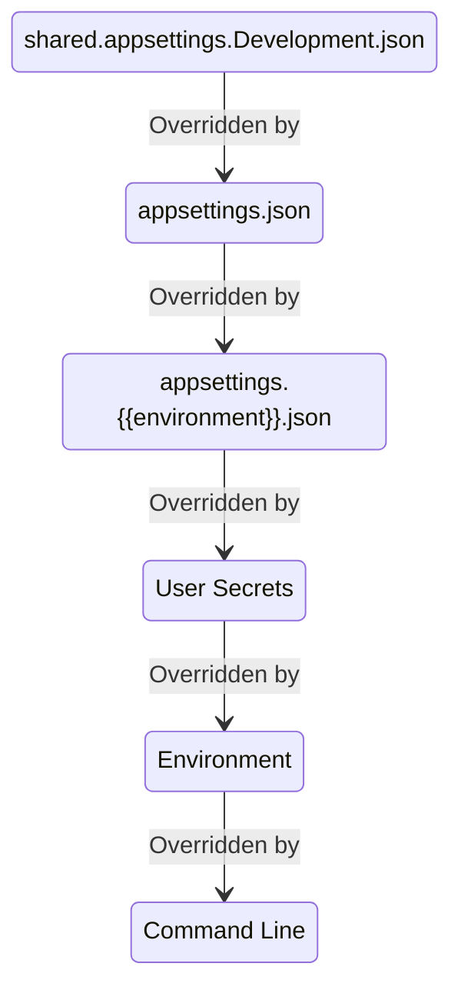

# IConfiguration & IOptions & ILogger Test

This repo has tests for `IOptions`, `IConfiguration`, and `ILogger`. This sample ASP.NET app demonstrates the topics briefly described below.

## [IConfiguration](https://docs.microsoft.com/en-us/dotnet/api/microsoft.extensions.configuration.iconfiguration)

This can be injected into any class and used to get loose values from configuration providers, or a section of values into an object.

### ASP.NET's Default IConfiguration

This is built when the ASP.NET app is built. The default [configuration in ASP.NET Core](https://docs.microsoft.com/en-us/aspnet/core/fundamentals/configuration/?view=aspnetcore-6.0#default-application-configuration-sources) has these providers in priority order:

1. CommandLine
1. Environment variables w/o ASPNETCORE_ or DOTNET_ prefix. Hierarchical values use __ separator everywhere (colon in JSON)
1. User secrets (dev only)
1. appsettings.{environment}.json where environment is ASPNETCORE_ENVIRONMENT value
1. appsettings.json
1. shared.appsettings.Development.json (custom one added)

This diagram shows what is read with each subsequent level adding or replacing values.



### Syntax for Values

For nested items, colons are used to separate the levels, except in environment variables, where double underscores are used.

### [JSON Files](https://docs.microsoft.com/en-us/aspnet/core/fundamentals/configuration#file-configuration-provider)

These are pretty straightforward. For complex objects, you may combine the levels with a colon, or split them. The following are equivalent:

```json
{
    "Snapshot:FromEnvironment":"test"
}
```

```json
{
    "Snapshot":
    {
        "FromEnvironment":"test"
    }
}
```

### [Environment Variables](https://docs.microsoft.com/en-us/aspnet/core/fundamentals/configuration#evcp)

Windows will tolerate colon separators, but it is best to always use double underscores, especially if you will be deploying to Linux, Mac or Linux containers.

```powershell
$env:OneTime__FromEnvironment = "EnvironmentSettings5"
```

### [Command Line](https://docs.microsoft.com/en-us/aspnet/core/fundamentals/configuration#command-line)

The syntax is not intuitive. You use `MyKey` to indicate how the key values are used, then follow that by the values. The following are all equivalent:

```powershell
dotnet run MyKey="Using =" Snapshot:FromEnvironment=test
dotnet run /MyKey="Using /" /Snapshot:FromEnvironment=test
dotnet run --MyKey="Using --" --Snapshot:FromEnvironment=test
```

## [Options Pattern](https://docs.microsoft.com/en-us/aspnet/core/fundamentals/configuration/options)

The Option pattern uses IConfiguration, but binds a POCO to a configuration section. The POCO is wrapper with in IOption* interface, which can be injected into any class. There are three flavors:

* [IOptions&lt;TOptions&gt;](https://docs.microsoft.com/en-us/dotnet/api/microsoft.extensions.options.ioptions-1) are read once, the first time accessed.
* [IOptionsMonitor&lt;TOptions&gt;](https://docs.microsoft.com/en-us/dotnet/api/microsoft.extensions.options.ioptionsmonitor-1) are read each time and are a singleton.
* [IOptionsSnapshot&lt;TOptions&gt;](https://docs.microsoft.com/en-us/dotnet/api/microsoft.extensions.options.ioptionssnapshot-1) are read each time and are a scopes so can be injected anywhere.

### Options Validation Using Attributes

Using `ValidateDataAnnotations` when registering options in `program.cs` will validate values of configuration when it is accessed the first time and throw an exception. This may occur long after app startup if the option isn't used earlier. `ValidateOnStart` can do validation when the app starts so you find out very early if your config is bad. `program.cs` in this sample does both.

## ILogger

ASP.NET has [ILogger](https://docs.microsoft.com/en-us/dotnet/api/microsoft.extensions.logging.ilogger) configured out of the box. This app adds a line of code to add [Serilog](https://serilog.net/) support that adds a wide range of options, formatters, and sinks.

All the configuration is done via the `IConfiguation` so you can have local development setup logging in `appsettings.Development.json` to override default logging setup in `appsettings.json`.

In this program for dev logging is to the console, in human readable format, whereas `appsettings.json` is set for using ElasticSearch logging. Log levels are read periodically so you can change them without restarting the app.

There are many sinks available, even one for Sentry (commented out in this sample) so you can configure all Error-level messages to automatically be sent there.

## Test App's Endpoints

| Name                   | Description                                               |
| ---------------------- | --------------------------------------------------------- |
| /api/config            | Get Configuration from loose values                       |
| /api/config/section    | Get Configuration from one section                        |
| /api/options           | Get configuration via IOptions (no refresh)               |
| /api/options/monitored | Get configuration via IOptionsMonitor                     |
| /api/options/snapshot  | Get configuration via IOptionsSnapshot                    |
| /api/options/throw     | Sample to throw an error to demonstration logging scope   |
| /api/logger            | Log a message in 3 = INFO, 4 = WARN, 5 = ERROR, 6 = FATAL |

### Links

* Rico Suter has a blog logging best practices [here](https://blog.rsuter.com/logging-with-ilogger-recommendations-and-best-practices/)
* Andrew Lock has a [post](https://andrewlock.net/how-to-include-scopes-when-logging-exceptions-in-asp-net-core/) about using BeginScope and the trick to use them when exceptions are thrown
* [Nicholas Blumhardt's blog](https://nblumhardt.com/) has many entries about Logging and Serilog
* Andrew Lock on [using .NET6 source generator for logging](https://andrewlock.net/exploring-dotnet-6-part-8-improving-logging-performance-with-source-generators/)
* Andrew Lock on [error handling](https://andrewlock.net/creating-a-custom-error-handler-middleware-function/)
* Doc for [ProblemDetails](https://docs.microsoft.com/en-us/dotnet/api/microsoft.aspnetcore.mvc.problemdetails)
* Andrew Lock on [using named configration sections](https://andrewlock.net/using-multiple-instances-of-strongly-typed-settings-with-named-options-in-net-core-2-x/). This repo doesn't demonstrate this, but this blog shows how you can create one POCO, and register multiple named instances of it in the configuration.

## Running Seq Locally

This repo logs to [Seq](https://datalust.co/seq) by default. Seq is a logging aggregator that you can run locally to see friendly versions of semantic logs.

```powershell
docker run -d --restart unless-stopped --name seq -e ACCEPT_EULA=Y -p 5341:80 datalust/seq:latest
```

Then hit http://localhost:5341/#/events to see the logs.

## Exercising the Endpoints From PowerShell

There some helper scripts in the root

* ./c.ps1 # IConfiguration config
* ./o.ps1 # IOptions
* ./a.ps1 # all config
* ./l.ps1 # logging

## Console Apps

All of this can also be used in Console apps, but requires a bit more code since ASP.NET does so much for you. See other samples for its use.

## Generating Code From the OAS file

I used an [OAS file](oas/openapi.yaml) to generate code. This [repo](https://github.com/Seekatar/swagger-codegen) is the one I created and use to generate code from the OAS file.

## Codespace-Enabled Repo

[Codespaces](https://github.com/features/codespaces) were announced May 2020. I immediately signed up to be in the beta, and I was finally included two years later. This repo is enabled to use Codespaces, and the `.devcontainer` folder had the customization for running this app.

Click [here](https://github.com/features/codespaces/signup?utm_source=visualstudio.microsoft.com&utm_medium=referral&utm_campaign=vscs) to sign up for the beta.

## My Blog

I randomly blog [here](https://seekatar.github.io/) using GitHub and Jekyll.
