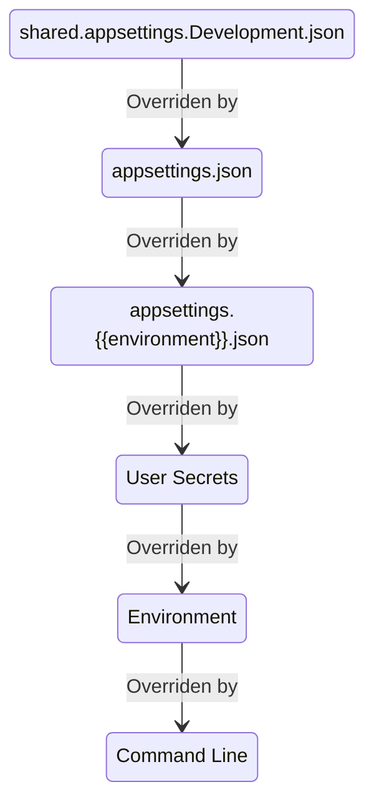

# IConfiguration & IOptions & ILogger Test

Test for `IOptions`, `IConfiguration`, and `ILogger`. This sample app demonstrates the topics describe below, and is not an exhaustive discussion.

## Configuration

### ASP.NET IConfiguration

This is built when the ASP.NET app is built. The default [configuration in ASP.NET Core](https://docs.microsoft.com/en-us/aspnet/core/fundamentals/configuration/?view=aspnetcore-6.0#default-application-configuration-sources) has these providers in priority order:

1. CommandLine
1. Environment variables w/o ASPNETCORE_ or DOTNET_ prefix. Hierarchical values use __ separator everywhere (colon in JSON)
1. User secrets (dev only)
1. appsettings.{environment}.json where environment is ASPNETCORE_ENVIRONMENT value
1. appsettings.json
1. shared.appsettings.Development.json (custom one added)

This diagram shows what is read with each subsequent level adding or replacing values.



### [IConfiguration](https://docs.microsoft.com/en-us/dotnet/api/microsoft.extensions.configuration.iconfiguration)

This can be injected into any class and used to get loose values from configration providers, or a section of values into an object.

### [Options Pattern](https://docs.microsoft.com/en-us/aspnet/core/fundamentals/configuration/options)

This can also be injected into any class and binds to a group of values from config providers.

[IOptions&lt;TOptions&gt;](https://docs.microsoft.com/en-us/dotnet/api/microsoft.extensions.options.ioptions-1) are read once, the first time accessed.

[IOptionsMonitor&lt;TOptions&gt;](https://docs.microsoft.com/en-us/dotnet/api/microsoft.extensions.options.ioptionsmonitor-1) are read each time and are a singleton.

[IOptionsSnapshot&lt;TOptions&gt;](https://docs.microsoft.com/en-us/dotnet/api/microsoft.extensions.options.ioptionssnapshot-1) are read each time and are a scopes so can be injected anywhere.

### Options Validation Using Attributes

Using `ValidateDataAnnotations` when registering options in `program.cs` will validate values of configuration when it is accessed the first time and throw an exception. This may occur long after app startup if the option isn't used earlier. `ValidateOnStart` can do validation when the app starts so you find out very early if your config is bad. `program.cs` in this sample does both.

## ILogger

ASP.NET has [ILogger](https://docs.microsoft.com/en-us/dotnet/api/microsoft.extensions.logging.ilogger) configured out of the box. This app adds a line of code to add [Serilog](https://serilog.net/) support that adds a wide range of options, formatters, and sinks.

All the configuration is done via the `IConfiguation` so you can have local development setup logging in `appsettings.Development.json` to override default logging setup in `appsettings.json`.

In this program for dev logging is to the console, in human readable format, whereas `appsettings.json` is set for using ElasticSearch logging. Log levels are read periodically so you can change them without restarting the app.

There are many sinks available, even one for Sentry (commented out in this sample) so you can configure all Error-level messages to automatically be sent there.

## Test App's Endpoints

| Name                   | Description                                               |
| ---------------------- | --------------------------------------------------------- |
| /api/config            | Get Configuration from loose values                       |
| /api/config/section    | Get Configuration from one section                        |
| /api/options           | Get configuration via IOptions (no refresh)               |
| /api/options/monitored | Get configuration via IOptionsMonitor                     |
| /api/options/snapshot  | Get configuration via IOptionsSnapshot                    |
| /api/logger            | Log a message in 3 = INFO, 4 = WARN, 5 = ERROR, 6 = FATAL |

- Rico Suter has a blog logging best practices [here](https://blog.rsuter.com/logging-with-ilogger-recommendations-and-best-practices/)
- Andrew Lock has a [post](https://andrewlock.net/how-to-include-scopes-when-logging-exceptions-in-asp-net-core/) about using BeginScope and the trick to use them when exceptions are thrown
- Andrew Lock on [error handling](https://andrewlock.net/creating-a-custom-error-handler-middleware-function/)
- Doc for [ProblemDetails](https://docs.microsoft.com/en-us/dotnet/api/microsoft.aspnetcore.mvc.problemdetails)

## Exercising the Endpoints From PowerShell

There some helper scripts in the root

* ./c.ps1 # IConfiguration config
* ./o.ps1 # IOptions
* ./a.ps1 # all config
* ./l.ps1 # logging

## Console Apps

All of this can also be used in Console apps, but requires a bit more code since ASP.NET does so much for you. See other samples for its use.

## Generating Code From the OAS file

```powershell
../swagger-codegen/Invoke-SwaggerGen.ps1 -OASFile ./oas/openapi.yaml -Namespace IOptionTest -OutputFolder /mnt/c/temp/options -RenameController
```

## Codespace-Enabled Repo

[Codespaces](https://github.com/features/codespaces) were announced May 2020. I immediately signed up to be in the beta, and I was finally included two years later. This repo is enabled to use Codespaces, and the `.devcontainer` folder had the customization for running this app.

Click [here](https://github.com/features/codespaces/signup?utm_source=visualstudio.microsoft.com&utm_medium=referral&utm_campaign=vscs) to sign up for the beta.

## My Blog

I randomly blog [here](https://seekatar.github.io/) using GitHub and Jekyll.
